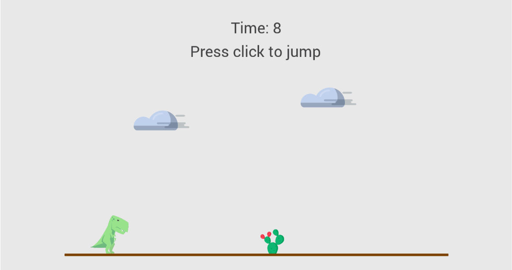

## Dinosaur game build with Revery

The main idea of this repo was to learn Revery and native ReasonML.

The code is based on the Workshop made by the [Revery's team](https://github.com/revery-ui) at **React Europe 2019** ([@brianphelps](https://github.com/bryphe), [@wokalski](https://github.com/wokalski) & [@rauanmayemir](https://github.com/rauanmayemir)).

It consisted on create a Flappy Bird clone [revery-ui/revery-workshop](https://github.com/revery-ui/revery-workshop). I turn it into the famous *[Chrome "No internet connection" Dino game](chrome://dino)*!

### Run it locally

**Pre-requisities**

- npm (6.5 or higher)
- esy (version 0.5.7): `npm install -g esy@0.5.7`
- Follow additional platform-specific instructors:
  - Mac: https://github.com/revery-ui/revery/wiki/Building-&-Installing#for-macos-users
  - Linux: https://github.com/revery-ui/revery/wiki/Building-&-Installing#for-macos-users
  - Windows: https://github.com/revery-ui/revery/wiki/Building-&-Installing#for-windows-native
- VSCode + `reason-vscode` extension (Recommended)

<!-- The first-time build can take a while, as the entire compiler toolchain is being built. -->

**Setup**

1. `git clone http://github.com/davesnx/dinosaur`
2. `cd dinosaur`
3. `esy install`
4. `esy build`
5. `esy run` <-- That will popup a window where the game runs!

### Roadmap
> or things that you could do to learn and improve the game
- Refactor anything!
- Add Dark mode
- Add horizontal speed incrementation
- Add enemies gap decrementation
- Add another kind of enemy: "therodactiles". Google Chrome dinosaur game have therodactiles that flies against the dinosaur when you cross 500 points.

## License

[MIT License](LICENSE)

### Disclamer

All the assets comes from some dribble that I downloaded ages ago. Don't know the source, I just created the animation of the Dino :D
